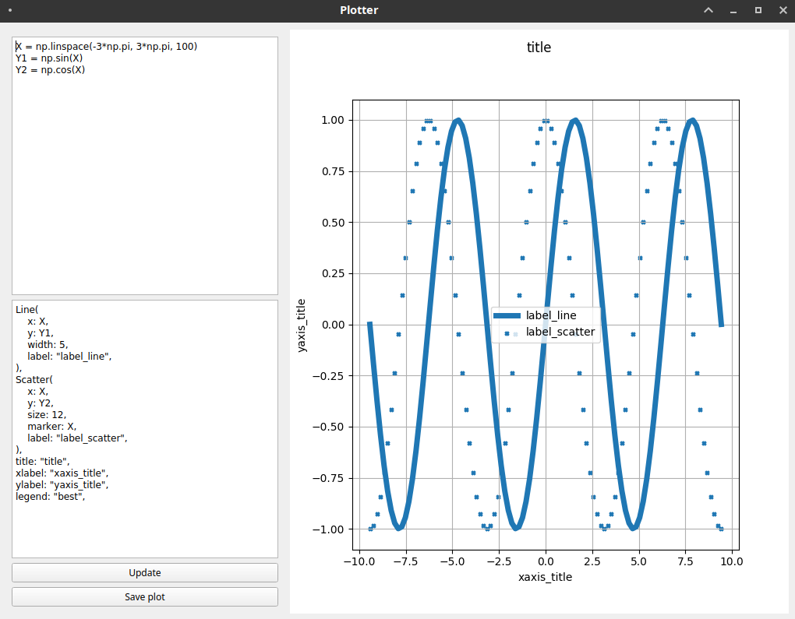

# Plotter

Declarative plotting & visualisation tool.

 - Author: **Adam Abed Abud**
 - Last update: February, 2021

Inspired by this [project](https://github.com/jaredvann/uplot/)

Uses matplotlib for backend and a PyQt GUI for the Plotter visualization.


## Usage
Before starting the application, make sure you have `matplotlib`, `lask` and `PyQt5` on your machine.

```sh
python3 main
```


## Screenshot




License
----

For the benefit of everyone.


**Free Software!**


